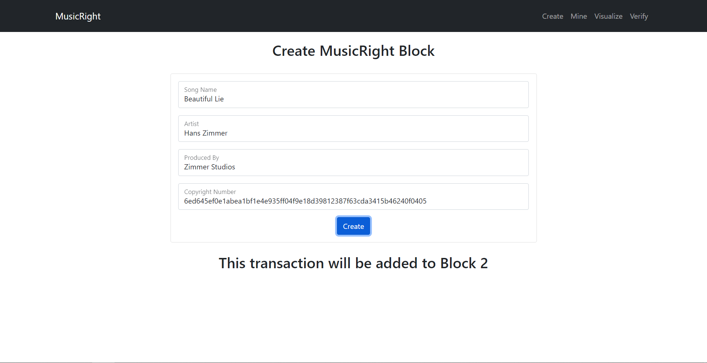
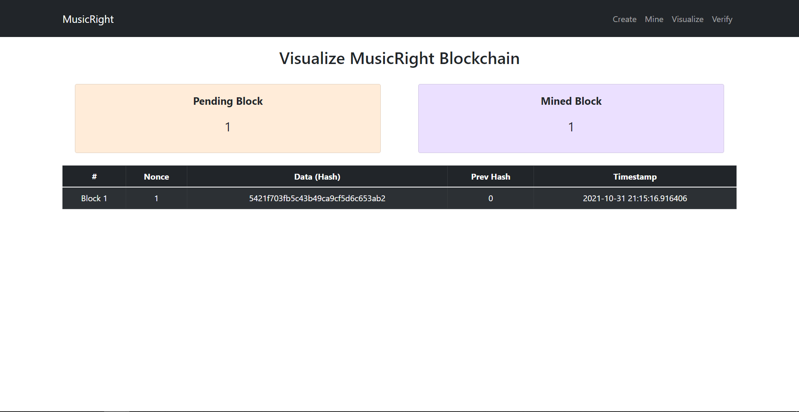
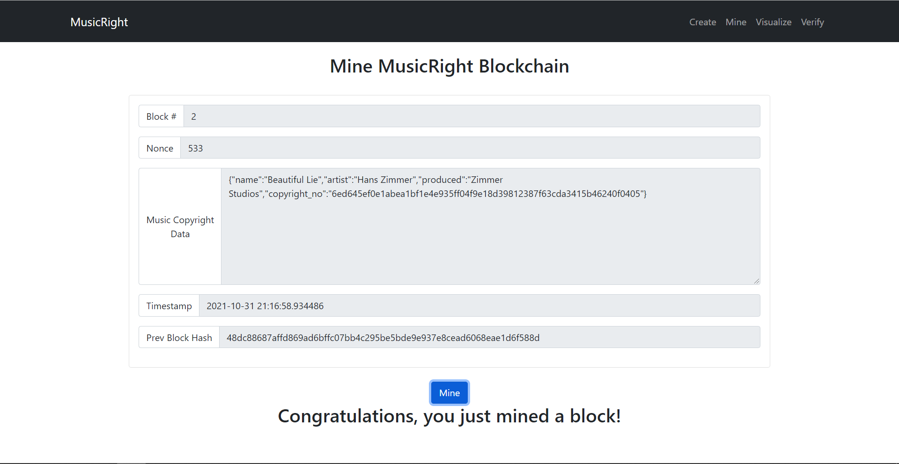
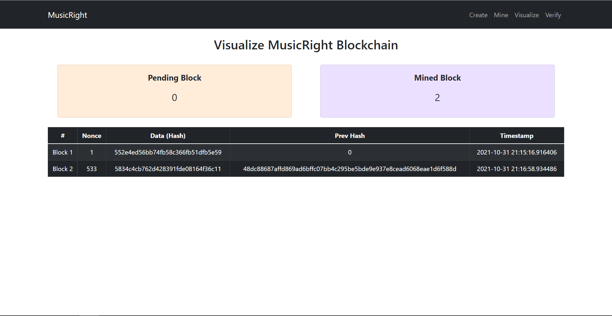
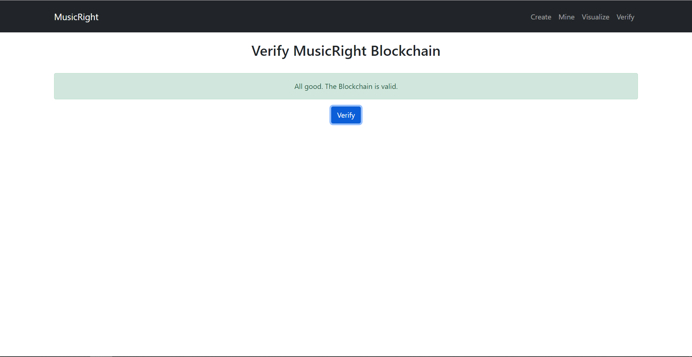

# Music Right Blockchain

A Blockchain based Music Copyright Management System using Python as Back End and React JS as Front End.

## Getting Started

- Clone the repository

```
git clone https://github.com/Hemanthhari2000/music_right_blockchain.git
```

- Run the django server using the following command

```python
python manage.py runserver
```

- Change directory and start react app using the following command

```javascript
npm start
```

## Demo

- Home/Create View
  

- Visualize Data
  

- Mine Blockchain Data
  

- Pending Block decrements and Mined Block increments (Proof of Work)
  

- Verify the whole Blockchain
  
